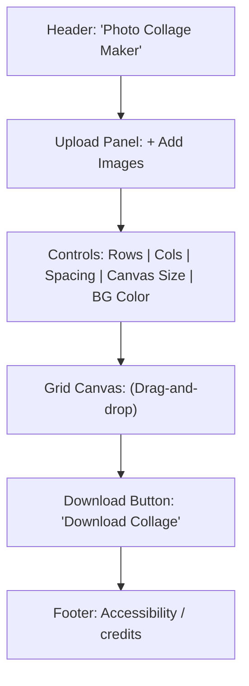

# Photo Collage Maker – Implementation Plan

## Overview

Photo Collage Maker is a streamlined, frontend-only web application that enables users to upload multiple photos, arrange them flexibly within a grid, and export or download the composed collage as a single image. The goal is user-centric simplicity: no authentication is required, usage is lightweight and entirely client-side, and all processing happens in the browser to preserve privacy and speed.

## Goals and Non-Goals

### Goals
- Enable users to upload multiple images simultaneously via drag-and-drop or file picker.
- Allow intuitive arrangement of images inside a grid, supporting reordering using drag-and-drop functionality.
- Provide controls to adjust grid size, gutter/spacing, and image fit options.
- Let users preview the collage and export/download it as a high-quality image (PNG/JPEG).
- Deliver a modern, responsive UI that is accessible across devices with rapid, fluid interactions.

### Non-Goals
- No user accounting, signup, or authentication.
- No server-side storage or image processing; images never leave the user's device.
- Social sharing, cloud saving, or advanced editing features (out of scope for MVP).

## User Stories

- As a user, I can upload several photos at once for my collage project.
- As a user, I can drag images to reorder them within the grid to achieve my desired layout.
- As a user, I can change the grid size (number of rows and columns) and the spacing (gutter) between images.
- As a user, I can preview the collage as it will appear in the exported image.
- As a user, I can download the composed collage as a single PNG or JPEG file.
- As a user, I can clear the whole canvas or remove selected images as needed.
- As a user, I benefit from keyboard-accessible controls, high-contrast focus indication, and screen reader support.

## Feature Breakdown

- **Image Upload**:
  - Drag-and-drop area and traditional file picker for batch image upload.
  - Instant thumbnail preview of uploaded images.
  - Client-side validation (image type and size).
- **Grid Layout**:
  - User-configurable number of rows and columns.
  - Adjustable gap/spacing (gutter) between grid cells.
  - Responsive, auto-fit grid (adapts to device width).
- **Drag-and-Drop Reordering**:
  - Interact with a drag-and-drop library (`@dnd-kit`).
  - Users can move images within the grid; keyboard reordering included for accessibility where possible.
- **Canvas/Export**:
  - Collage rendered onto a hidden HTML `<canvas>` element.
  - Export/download as PNG or JPEG preserving layout/fidelity.
- **Controls**:
  - Grid settings (rows, columns).
  - Spacing/gutter.
  - Image fit mode (cover/contain).
  - Background color selector for the collage.
- **Image Management**:
  - Remove individual images or clear all.
- **State Management**:
  - React hooks for local state.
  - Optional: layout/image state persisted to `localStorage`.
- **Accessibility & Responsiveness**:
  - Buttons and controls have `aria-label`s, tab order, descriptive alt text derived from filenames, and high-contrast focus states.

## Technical Architecture

- **Frontend Framework**: React (built with Vite or Create React App as per project setup).
- **Drag & Drop**: [`@dnd-kit`](https://dndkit.com/) for robust, accessible drag-and-drop reordering.
- **Rendering**: 
  - UI layout via CSS Grid and flexbox in pure CSS.
  - Collage export by rendering images to an HTML `<canvas>` (for PNG/JPEG download).
- **No Backend**: All image manipulation, arrangement, and export is handled client-side; environment variables provided for broader project alignment are **unused** in this MVP.
- **Directory Structure (suggested):**
  ```
  src/
    components/
      Uploader.jsx         # Handles file input/drag-drop
      Grid.jsx             # Layout grid & cell rendering
      Controls.jsx         # UI controls for grid settings
      CanvasExporter.jsx   # Canvas-based export/download
    hooks/
      useCollageState.js
    utils/
      imageHelpers.js
    styles/
      App.css, theme.css
    App.js, index.js
  ```
- **Dependencies**: 
  - React, @dnd-kit/core, @dnd-kit/sortable, HTML5 APIs
  - No large UI libraries (keeping the bundle ultra-light)

## UI/UX Design

### Visual Theme & Color System

- **Theme**: Modern, light mode-only by default.
- **Color palette**:
  - Primary: `#3b82f6` (blue)
  - Success/Accent: `#06b6d4` (cyan)
  - Error: `#EF4444` (red)
  - Text: `#111827` (very dark gray)
  - Surfaces: `#ffffff` (white)
  - Background: `#f9fafb` (almost white)
  - Secondary elements: `#64748b` (muted blue-gray)
- **Typography**: Clean, modern sans-serif (system UI or Google Fonts like Inter/Roboto).

### Core Layout

- **Header**: Minimal, centered title and one-line description.
- **Upload Panel**: Fixed at the top, with action button ("+ Add Images") and status text (e.g., count of loaded images).
- **Grid/Canvas Area**: Centered, responsive container. CSS Grid presents images as tiles. Grid auto-scales but maintains set rows/columns and spacing. 
- **Controls Panel**: Below or beside grid on desktop; included in top section for mobile. Controls for:
  - Grid size (Rows/Columns input)
  - Spacing/Gap (slider/input)
  - Canvas dimensions
  - Background color
- **Download Bar**: Prominently below the grid, featuring the "Download Collage" button (disabled if grid empty).
- **Footer**: Accessibility notes and app credits.

#### Layout Example (Visual Schematic)



### Accessibility

- All form controls and buttons with `aria-label`.
- Keyboard support for tab focus, image selection, removal, and reordering.
- Alt text for preview images generated from filenames.
- High-contrast focus indicators for all interactive elements.
- Responsive design: works well on mobile, tablet, desktop.

## Milestones and Deliverables

- **M1: UI Skeleton**
  - Basic app structure: header, upload area, empty grid/canvas, read-only controls.
- **M2: Multi-Image Upload**
  - Drag-and-drop and file picker upload, image preview, validation.
- **M3: Grid Mechanics**
  - Responsive, adjustable grid layout, controls for rows/cols/gap/background.
- **M4: Drag-and-Drop Reordering**
  - Integrate @dnd-kit for ordering grid tiles by drag/keyboard.
- **M5: Canvas Export**
  - Implement canvas composition and "Download Collage" as PNG/JPEG.
- **M6: Polishing**
  - Add simple animations, loading indicators, error handling, accessible labels, and visual polish.
- **Optional M7: Persistence and Advanced Layouts**
  - Persist layout and images to localStorage.
  - Add other arrangements: masonry/grid styles, new fit modes, aspect ratios.

## Non-Functional Requirements

- **Performance**: Smoothly handle 20–40 medium-resolution images with minimal lag.
- **Responsiveness**: Fully usable on smartphones, tablets, and desktops.
- **Accessibility**: All critical tasks are keyboard-accessible with proper ARIA roles.
- **Security & Privacy**: Pure client-side; no photo files leave the browser or are sent to any backend.

## Testing Strategy

- **Utils Unit Testing**: Test image utilities (canvas drawing, image sizing logic) with Jest.
- **Component Tests**: Use React Testing Library for Uploader and Grid controls—test file upload, drag-and-drop, control value changes.
- **Exploratory Manual Testing**: Physically verify drag-and-drop, edge cases (e.g., clearing images, max grid size, large/small canvases), canvas export correctness and browser compatibility.

## Future Enhancements

- Image manipulation: zoom, rotate, crop per cell.
- Layout templates, different aspect ratios, frames, or themes.
- Add text, stickers, and shapes to collage.
- Smart snap-to-grid and alignment guides.
- Share/export presets (Instagram, PDF, etc.).
- Undo/redo history.
- Internationalization/localization.

## Risks and Mitigations

- **Memory Issues with Large Images**  
  _Mitigation_: Downscale thumbnails, limit canvas size, inform users if files are very large.
- **Browser CORS with Export**  
  _Mitigation_: Only use local uploads and data URIs, so no cross-origin issues should occur.
- **Accessibility for Drag & Drop**  
  _Mitigation_: Supplement drag-and-drop with arrow keys or up/down buttons for reordering, clear tab order, and strong ARIA feedback.

---

*This implementation plan is designed to guide development from first commit through MVP and future extensions, ensuring maintainability and alignment with user-focused requirements and the specified modern, light visual style.*

